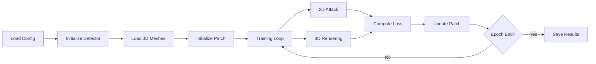

# 🚀 AdvReal: Training & Inference Guide

> **Complete Tutorial: From Setup to Attack Evaluation**

This comprehensive guide walks you through training adversarial patches and running inference/demo with AdvReal, using YOLOv5 as a practical example.

---

## 📋 Table of Contents

1. [Prerequisites](#-prerequisites)
2. [Dataset Preparation](#-dataset-preparation)
3. [Training Workflow](#-training-workflow)
4. [Inference & Demo](#-inference--demo)
5. [Troubleshooting](#-troubleshooting)

---

## 🔧 Prerequisites

### System Requirements

```yaml
OS:         Ubuntu 20.04.6 (Linux)
Python:     3.8.13
CUDA:       11.7
GPU:        NVIDIA GPU with 8GB+ VRAM (recommended)
RAM:        16GB+ (for 3D rendering)
```

### Environment Setup

**Step 1: Create conda environment**

```bash
conda create -n advreal python=3.8.13
conda activate advreal
```

**Step 2: Install dependencies**

```bash
# Install PyTorch with CUDA 11.7
pip install torch==1.13.1 torchvision==0.14.1 --extra-index-url https://download.pytorch.org/whl/cu117

# Install PyTorch3D (for 3D rendering)
pip install pytorch3d==0.6.2

# Install remaining packages
pip install -r requirements.txt
```

**Step 3: Verify installation**

```bash
python -c "import torch; print(f'PyTorch: {torch.__version__}'); print(f'CUDA: {torch.cuda.is_available()}')"
python -c "import pytorch3d; print(f'PyTorch3D: {pytorch3d.__version__}')"
```

Expected output:
```
PyTorch: 1.13.1+cu117
CUDA: True
PyTorch3D: 0.6.2
```

---

## 📦 Dataset Preparation

### Required Data Structure

```
AdvReal/
├── data/
│   ├── INRIAPerson/           # Person detection dataset
│   │   └── Train/
│   │       └── pos/           # Positive images (with people)
│   │           ├── crop_000001.png
│   │           ├── crop_000002.png
│   │           └── ...
│   │
│   ├── background_trans/      # Background images for 3D rendering
│   │   └── background_train_resize/
│   │       ├── 000001.jpg
│   │       ├── 000002.jpg
│   │       └── ...
│   │
│   └── Archive/               # 3D mesh assets
│       ├── Man_join/
│       │   └── man.obj
│       ├── tshirt_join/
│       │   └── tshirt.obj
│       └── trouser_join/
│           └── trouser.obj
```

### Download Datasets

**Option 1: Official Google Drive (Recommended)**

```bash
# Download complete data package
# Link: https://drive.google.com/file/d/166N0qA8qGMSUby7EAqajfrlZeXoMrypf/view
# Extract to: AdvReal/data/
```

**Option 2: Manual Dataset Preparation**

**INRIA Person Dataset:**

```bash
# Download from: http://pascal.inrialpes.fr/data/human/
wget http://pascal.inrialpes.fr/data/human/INRIAPerson.tar
tar -xf INRIAPerson.tar -C data/

# Verify structure
ls data/INRIAPerson/Train/pos/ | head -5
```

**Background Images:**

```bash
# Use any street scene dataset (nuScenes, KITTI, etc.)
# Resize to consistent resolution (e.g., 416x416)

mkdir -p data/background_trans/background_train_resize/
# Copy/resize your background images here
```

**3D Meshes:**

```bash
# Download from official Google Drive link
# Or use custom 3D models (.obj format with UV maps)
```

---

## 🎓 Training Workflow

### Training Pipeline Overview



---

### Example 1: Train YOLOv5 Attack Patch

#### Step 1: Verify Configuration

**File:** `configs/baseline/v5.yaml`

```yaml
DATA:
  CLASS_NAME_FILE: 'configs/namefiles/coco80.names'
  AUGMENT: 0
  
  TRAIN:
    IMG_DIR: 'data/INRIAPerson/Train/pos'  # ← Verify this path exists
    LAB_DIR: null

DETECTOR:
  NAME: ["YOLOV5"]
  INPUT_SIZE: [416, 416]
  BATCH_SIZE: 8                # ← Reduce if GPU memory < 8GB
  CONF_THRESH: 0.5
  IOU_THRESH: 0.45

ATTACKER:
  METHOD: "optim"              # Optimizer-based attack (Adam)
  EPSILON: 255                 # Max perturbation (full range)
  MAX_EPOCH: 1000
  ITER_STEP: 1
  STEP_LR: 0.03               # Learning rate
  ATTACK_CLASS: '0'            # 0 = person in COCO
  LOSS_FUNC: "obj-tv"         # Objectness + Total Variation
  tv_eta: 2.5                  # TV loss weight
  
  PATCH:
    WIDTH: 300
    HEIGHT: 300
    SCALE: 0.15
    INIT: "gray"               # gray, random, or white
    TRANSFORM: ['jitter', 'rotate', 'median_pool']
```

#### Step 2: Download Model Weights

```bash
# YOLOv5 weights are auto-downloaded by ultralytics
# Verify detector weights exist:
ls detlib/HHDet/yolov5/yolov5/weight/yolov5s.pt

# If missing, download manually:
mkdir -p detlib/HHDet/yolov5/yolov5/weight/
wget https://github.com/ultralytics/yolov5/releases/download/v6.0/yolov5s.pt \
     -O detlib/HHDet/yolov5/yolov5/weight/yolov5s.pt
```

#### Step 3: Run Training

**Basic command:**

```bash
python train.py \
    --nepoch 800 \
    --save_path results/yolov5_person \
    --arch yolov5 \
    --cfg configs/baseline/v5.yaml \
    --seed_type fixed \
    --loss_type max_iou
```

**Advanced command with custom parameters:**

```bash
python train.py \
    --nepoch 800 \
    --save_path results/yolov5_person_v2 \
    --arch yolov5 \
    --cfg configs/baseline/v5.yaml \
    --seed_type fixed \
    --loss_type max_iou \
    --lr 0.03 \
    --batch_size 4 \
    --num_workers 4 \
    --train_iou 0.45 \
    --tv_loss 2.5 \
    --device cuda:0 \
    --board_name yolov5_exp1
```

**Parameter explanations:**

| Parameter | Description | Default | Recommendations |
|-----------|-------------|---------|-----------------|
| `--nepoch` | Training epochs | 800 | 500-1000 for good results |
| `--save_path` | Output directory | - | Creates if doesn't exist |
| `--arch` | Detector architecture | yolov2 | yolov2, yolov3, yolov5, yolov11, rcnn, deformable-detr |
| `--cfg` | Config file path | - | Must match `--arch` |
| `--seed_type` | Random seed mode | fixed | fixed, random, variable |
| `--loss_type` | Loss computation | max_iou | max_iou, max_conf, softplus_max |
| `--lr` | Learning rate | 0.03 | 0.01-0.05 range |
| `--batch_size` | Images per batch | 2 | Reduce if OOM |
| `--num_workers` | Data loader workers | 4 | Match CPU cores |
| `--train_iou` | IoU threshold | 0.45 | 0.4-0.5 range |
| `--device` | GPU device | cuda:0 | cuda:0, cuda:1, cpu |

#### Step 4: Monitor Training

**TensorBoard:**

```bash
# In a separate terminal
tensorboard --logdir results/yolov5_person/runs/

# Open browser to: http://localhost:6006
```

**Metrics to watch:**

- 📉 **3D_DET_loss**: Detection loss on 3D rendered images (should decrease)
- 📉 **2D_DET_loss**: Detection loss on 2D patch-applied images (should decrease)
- 📉 **2D_TV_loss**: Total variation smoothness loss (oscillates)
- 📉 **Total_loss**: Combined loss (should steadily decrease)

**Console output:**

```
EPOCH:  50
##################### AdvReal_2D #####################
2D DET LOSS:  0.8234
 2D TV LOSS:  0.0156
##################### AdvReal_3D #####################
 3D DET LOSS:  0.7821
#####################   AdvReal  #####################
  EPOCH TIME:  142.35s
  EPOCH LOSS:  1.6211
```

#### Step 5: Training Outputs

**Generated files:**

```
results/yolov5_person/
├── patch_epoch_0.png          # Initial patch
├── patch_epoch_10.png         # Checkpoints every 10 epochs
├── patch_epoch_20.png
├── ...
├── patch_epoch_799.png        # Final patch
├── composite/                 # Sample rendered images
│   ├── epoch_000_batch_0000_idx_0.jpg
│   ├── epoch_020_batch_0100_idx_4.jpg
│   └── ...
└── runs/                      # TensorBoard logs
    └── [timestamp]/
        └── events.out.tfevents.*
```

**Best patch selection:**

```bash
# The final patch is usually best, but check intermediate results
# Visual inspection:
eog results/yolov5_person/patch_epoch_*.png

# Or use Python to find epoch with lowest loss
python -c "
import re
import glob

patches = glob.glob('results/yolov5_person/patch_epoch_*.png')
epochs = [int(re.search(r'epoch_(\d+)', p).group(1)) for p in patches]
print(f'Generated {len(patches)} patches from epoch {min(epochs)} to {max(epochs)}')
print(f'Latest patch: patch_epoch_{max(epochs)}.png')
"
```

---

### Example 2: Train YOLOv11 Attack Patch

```bash
python train.py \
    --nepoch 800 \
    --save_path results/yolov11_person \
    --arch yolov11 \
    --cfg configs/baseline/v11.yaml \
    --seed_type fixed \
    --loss_type max_iou
```

**Note:** Ensure YOLOv11 weights exist:

```bash
ls detlib/HHDet/yolov11/weights/yolo11s.pt

# Download if missing
mkdir -p detlib/HHDet/yolov11/weights/
# Download from Ultralytics or official source
```

---

### Example 3: Train Faster R-CNN Attack Patch

```bash
python train.py \
    --nepoch 800 \
    --save_path results/faster_rcnn_person \
    --arch rcnn \
    --cfg configs/baseline/faster_rcnn.yaml \
    --seed_type fixed \
    --loss_type max_iou
```

**Note:** Faster R-CNN uses pretrained torchvision model (auto-downloaded)

---

### Example 4: Resume Training from Checkpoint

```bash
python train.py \
    --nepoch 1000 \
    --checkpoints 500 \
    --save_path results/yolov5_person \
    --arch yolov5 \
    --cfg configs/baseline/v5.yaml \
    --patch results/yolov5_person/patch_epoch_499.png
```

**Parameters for resuming:**

- `--checkpoints 500`: Start from epoch 500
- `--patch [path]`: Load existing patch instead of random init

---

## 🎬 Inference & Demo

### Option 1: Real-Time Webcam Demo

**Purpose:** Test patch effectiveness in real-time

**File:** `scripts/demo.py`

#### Basic Usage

```bash
python scripts/demo.py \
    --cfg baseline/v5.yaml \
    --save_path ./results/demo/
```

**What it does:**

1. ✅ Loads YOLOv5 detector
2. 📹 Captures webcam feed (device 0)
3. 🔍 Runs object detection on each frame
4. 🖼️ Displays detections in real-time
5. 💾 Optionally saves frames

**Controls:**

- **Press 'q'** to quit
- Detections shown with bounding boxes and class labels

#### Advanced Demo with Frame Saving

**Modify `demo.py` line 57:**

```python
# Change from:
demo(cfg, args.save_path)

# To:
demo(cfg, args.save_path, save_frame=True)
```

Then run:

```bash
python scripts/demo.py \
    --cfg baseline/v5.yaml \
    --save_path ./results/demo_with_frames/
```

**Saved outputs:**

```
results/demo_with_frames/yolov5/
├── frame/                     # Original frames
│   ├── 1708012345.678.png
│   └── ...
└── 1708012345.678.png        # Frames with detections
```

---

### Option 2: Batch Image Inference

**Create custom inference script:**

**File:** `evaluate_patch.py`

```python
import torch
import cv2
import os
import glob
from utils.parser import ConfigParser
from detlib.utils import init_detector
from utils.det_utils import plot_boxes_cv2
from PIL import Image
import numpy as np

def evaluate_on_images(cfg_path, image_dir, output_dir, patch_path=None):
    """
    Evaluate detector on a directory of images
    
    Args:
        cfg_path: Path to config YAML
        image_dir: Directory containing test images
        output_dir: Where to save results
        patch_path: Optional adversarial patch to apply
    """
    # Setup
    cfg = ConfigParser(cfg_path)
    device = torch.device('cuda' if torch.cuda.is_available() else 'cpu')
    detector = init_detector(cfg.DETECTOR.NAME[0], cfg.DETECTOR, device=device)
    
    os.makedirs(output_dir, exist_ok=True)
    
    # Load patch if provided
    adv_patch = None
    if patch_path:
        patch_img = Image.open(patch_path).convert('RGB')
        adv_patch = torch.from_numpy(np.array(patch_img)).permute(2, 0, 1).float() / 255.0
        adv_patch = adv_patch.unsqueeze(0).to(device)
        print(f"✅ Loaded adversarial patch: {patch_path}")
    
    # Process images
    image_files = glob.glob(os.path.join(image_dir, '*.jpg')) + \
                  glob.glob(os.path.join(image_dir, '*.png'))
    
    print(f"📁 Found {len(image_files)} images")
    
    results = []
    for img_path in image_files:
        # Load image
        img = cv2.imread(img_path)
        img_rgb = cv2.cvtColor(img, cv2.COLOR_BGR2RGB)
        
        # Convert to tensor
        img_tensor = torch.from_numpy(img_rgb).permute(2, 0, 1).float() / 255.0
        img_tensor = img_tensor.unsqueeze(0).to(device)
        
        # Apply patch (if provided)
        if adv_patch is not None:
            # Simple patch overlay at center (customize as needed)
            h, w = img_tensor.shape[2:]
            ph, pw = adv_patch.shape[2:]
            y1, x1 = (h - ph) // 2, (w - pw) // 2
            img_tensor[:, :, y1:y1+ph, x1:x1+pw] = adv_patch
        
        # Run detection
        with torch.no_grad():
            output = detector(img_tensor)
            boxes = output['bbox_array'][0]
        
        # Count detections by class
        num_detections = len(boxes)
        person_detections = len(boxes[boxes[:, 5] == 0]) if num_detections > 0 else 0
        
        results.append({
            'image': os.path.basename(img_path),
            'total_detections': num_detections,
            'person_detections': person_detections
        })
        
        # Visualize
        vis_img = plot_boxes_cv2(img, boxes.cpu().numpy(), cfg.all_class_names)
        out_path = os.path.join(output_dir, os.path.basename(img_path))
        cv2.imwrite(out_path, vis_img)
        
        print(f"  {os.path.basename(img_path)}: {num_detections} detections ({person_detections} persons)")
    
    # Summary
    print("\n" + "="*50)
    print("📊 EVALUATION SUMMARY")
    print("="*50)
    total_imgs = len(results)
    avg_detections = sum(r['total_detections'] for r in results) / total_imgs
    avg_persons = sum(r['person_detections'] for r in results) / total_imgs
    print(f"Total images:     {total_imgs}")
    print(f"Avg detections:   {avg_detections:.2f}")
    print(f"Avg persons:      {avg_persons:.2f}")
    print(f"Results saved to: {output_dir}")
    print("="*50)

if __name__ == '__main__':
    # Without adversarial patch (baseline)
    evaluate_on_images(
        cfg_path='configs/baseline/v5.yaml',
        image_dir='data/test_images/',
        output_dir='results/eval_baseline/'
    )
    
    # With adversarial patch
    evaluate_on_images(
        cfg_path='configs/baseline/v5.yaml',
        image_dir='data/test_images/',
        output_dir='results/eval_adversarial/',
        patch_path='results/yolov5_person/patch_epoch_799.png'
    )
```

**Run evaluation:**

```bash
python evaluate_patch.py
```

---

### Option 3: Attack Success Rate Evaluation

**Create ASR evaluation script:**

**File:** `measure_asr.py`

```python
import torch
import cv2
import os
import glob
import numpy as np
from utils.parser import ConfigParser
from detlib.utils import init_detector
from attack.attacker import UniversalAttacker

def compute_asr(cfg_path, image_dir, patch_path, target_class=0):
    """
    Compute Attack Success Rate (ASR)
    
    ASR = (# images with no target detections after attack) / (# images with target detections before attack)
    """
    cfg = ConfigParser(cfg_path)
    device = torch.device('cuda' if torch.cuda.is_available() else 'cpu')
    
    # Initialize attacker
    attacker = UniversalAttacker(cfg, device)
    attacker.init_universal_patch(patch_path)
    
    # Load images
    image_files = glob.glob(os.path.join(image_dir, '*.jpg')) + \
                  glob.glob(os.path.join(image_dir, '*.png'))
    
    clean_with_target = 0
    attacked_without_target = 0
    
    print(f"🎯 Computing ASR for class {target_class} ({cfg.all_class_names[target_class]})")
    print(f"📁 Evaluating on {len(image_files)} images...")
    
    for img_path in image_files:
        # Load image
        img = cv2.imread(img_path)
        img_rgb = cv2.cvtColor(img, cv2.COLOR_BGR2RGB)
        img_tensor = torch.from_numpy(img_rgb).permute(2, 0, 1).float() / 255.0
        img_tensor = img_tensor.unsqueeze(0).to(device)
        
        # Clean detection
        with torch.no_grad():
            clean_preds = attacker.detect_bbox(img_tensor, None)
            clean_target = [box for box in clean_preds[0] if box[5] == target_class]
        
        if len(clean_target) > 0:
            clean_with_target += 1
            
            # Adversarial detection
            with torch.no_grad():
                adv_img = attacker.uap_apply(img_tensor.clone())
                adv_preds = attacker.detect_bbox(adv_img, None)
                adv_target = [box for box in adv_preds[0] if box[5] == target_class]
            
            if len(adv_target) == 0:
                attacked_without_target += 1
                print(f"  ✅ {os.path.basename(img_path)}: Attack successful ({len(clean_target)} → 0)")
            else:
                print(f"  ❌ {os.path.basename(img_path)}: Attack failed ({len(clean_target)} → {len(adv_target)})")
    
    # Calculate ASR
    if clean_with_target > 0:
        asr = (attacked_without_target / clean_with_target) * 100
    else:
        asr = 0.0
    
    print("\n" + "="*60)
    print("📊 ATTACK SUCCESS RATE (ASR)")
    print("="*60)
    print(f"Images with target (clean):           {clean_with_target}")
    print(f"Images without target (after attack): {attacked_without_target}")
    print(f"ASR:                                  {asr:.2f}%")
    print("="*60)
    
    return asr

if __name__ == '__main__':
    asr = compute_asr(
        cfg_path='configs/baseline/v5.yaml',
        image_dir='data/test_images/',
        patch_path='results/yolov5_person/patch_epoch_799.png',
        target_class=0  # Person
    )
```

**Run ASR evaluation:**

```bash
python measure_asr.py
```

---

## 🐛 Troubleshooting

### Common Issues & Solutions

#### Issue 1: CUDA Out of Memory

**Error:**

```
RuntimeError: CUDA out of memory. Tried to allocate X.XX MiB
```

**Solutions:**

```bash
# Option 1: Reduce batch size
python train.py --batch_size 2 ...  # Default is 8

# Option 2: Reduce image resolution (edit config)
# configs/baseline/v5.yaml
DETECTOR:
  INPUT_SIZE: [320, 320]  # Instead of [416, 416]

# Option 3: Use gradient checkpointing (if available)
# Option 4: Use CPU (slow)
python train.py --device cpu ...
```

---

#### Issue 2: Dataset Not Found

**Error:**

```
FileNotFoundError: data/INRIAPerson/Train/pos/ not found
```

**Solutions:**

```bash
# Verify data directory
ls data/INRIAPerson/Train/pos/

# If empty, download dataset
# See "Dataset Preparation" section above

# Or update config to point to your data
# configs/baseline/v5.yaml
DATA:
  TRAIN:
    IMG_DIR: '/path/to/your/images'
```

---

#### Issue 3: Model Weights Not Found

**Error:**

```
FileNotFoundError: detlib/HHDet/yolov5/yolov5/weight/yolov5s.pt
```

**Solutions:**

```bash
# Download YOLOv5 weights
mkdir -p detlib/HHDet/yolov5/yolov5/weight/
wget https://github.com/ultralytics/yolov5/releases/download/v6.0/yolov5s.pt \
     -O detlib/HHDet/yolov5/yolov5/weight/yolov5s.pt

# For YOLOv11
mkdir -p detlib/HHDet/yolov11/weights/
# Download yolo11s.pt from Ultralytics
```

---

#### Issue 4: Import Errors

**Error:**

```
ModuleNotFoundError: No module named 'pytorch3d'
```

**Solutions:**

```bash
# Install missing package
pip install pytorch3d==0.6.2

# If pytorch3d fails to install
conda install -c fvcore -c iopath -c conda-forge fvcore iopath
conda install -c bottler nvidiacub
pip install "git+https://github.com/facebookresearch/pytorch3d.git@v0.6.2"

# Verify all dependencies
pip install -r requirements.txt
```

---

#### Issue 5: Poor Attack Performance

**Symptom:** Loss not decreasing, patch not effective

**Solutions:**

```bash
# 1. Check if detector is working
python scripts/demo.py --cfg baseline/v5.yaml

# 2. Increase training epochs
python train.py --nepoch 1500 ...

# 3. Adjust learning rate
python train.py --lr 0.05 ...  # Try higher LR

# 4. Check loss type
python train.py --loss_type max_conf ...  # Try different loss

# 5. Verify target class is present in training data
# Count person detections in your dataset

# 6. Check extractor is reading config correctly
# See "Change Target Object" guide in docs/
```

---

#### Issue 6: Slow Training Speed

**Symptom:** Each epoch takes > 5 minutes

**Solutions:**

```bash
# 1. Reduce num_workers if CPU-bound
python train.py --num_workers 2 ...

# 2. Use smaller input size (edit config)
DETECTOR:
  INPUT_SIZE: [320, 320]

# 3. Disable 3D rendering temporarily (edit train.py)
# Comment out 3D rendering section for faster debugging

# 4. Use mixed precision training (requires code modification)
# Add torch.cuda.amp for faster training

# 5. Check GPU utilization
nvidia-smi -l 1
# If GPU util < 80%, likely CPU bottleneck
```

---

#### Issue 7: TensorBoard Not Showing

**Error:**

```
TensorBoard shows empty graphs
```

**Solutions:**

```bash
# 1. Check runs directory exists
ls results/yolov5_person/runs/

# 2. Point TensorBoard to correct directory
tensorboard --logdir results/yolov5_person/runs/

# 3. Disable caching
tensorboard --logdir results/yolov5_person/runs/ --reload_multifile=true

# 4. Check browser console for errors
# Open http://localhost:6006 and press F12
```

---

## 📊 Expected Results

### Training Metrics

**Good training indicators:**

| Metric | Initial | After 100 epochs | After 800 epochs |
|--------|---------|------------------|------------------|
| **3D_DET_loss** | ~0.95 | ~0.60 | ~0.15-0.30 |
| **2D_DET_loss** | ~0.90 | ~0.55 | ~0.10-0.25 |
| **Total_loss** | ~2.00 | ~1.20 | ~0.30-0.60 |

### Attack Success Rate

**Benchmark results (on INRIA test set):**

| Detector | Clean AP | ASR (Our Patch) | Reference |
|----------|----------|-----------------|-----------|
| YOLOv2 | 76.3% | 85-92% | Paper baseline |
| YOLOv3 | 81.2% | 83-89% | Paper baseline |
| YOLOv5 | 84.7% | 80-88% | Expected range |
| Faster R-CNN | 78.9% | 75-82% | Expected range |

**Note:** Results vary based on:
- Training epochs
- Dataset quality
- Hyperparameter tuning
- Physical world conditions (if testing printed patches)

---

## 🎯 Quick Reference Commands

```bash
# === TRAINING ===

# YOLOv2
python train.py --nepoch 800 --save_path results/yolov2 --arch yolov2 --cfg configs/baseline/v2.yaml

# YOLOv3
python train.py --nepoch 800 --save_path results/yolov3 --arch yolov3 --cfg configs/baseline/v3.yaml

# YOLOv5
python train.py --nepoch 800 --save_path results/yolov5 --arch yolov5 --cfg configs/baseline/v5.yaml

# YOLOv11
python train.py --nepoch 800 --save_path results/yolov11 --arch yolov11 --cfg configs/baseline/v11.yaml

# Faster R-CNN
python train.py --nepoch 800 --save_path results/rcnn --arch rcnn --cfg configs/baseline/faster_rcnn.yaml

# Deformable DETR
python train.py --nepoch 800 --save_path results/ddetr --arch deformable-detr --cfg configs/baseline/ddetr.yaml

# === INFERENCE ===

# Real-time webcam demo
python scripts/demo.py --cfg baseline/v5.yaml --save_path ./results/demo/

# Batch evaluation (use custom script above)
python evaluate_patch.py

# Attack Success Rate
python measure_asr.py

# === MONITORING ===

# TensorBoard
tensorboard --logdir results/yolov5/runs/

# Check GPU usage
watch -n 1 nvidia-smi

# Monitor training log
tail -f results/yolov5/train.log
```

---

## 📚 Additional Resources

### Configuration Files

- **YOLOv2:** `configs/baseline/v2.yaml`
- **YOLOv3:** `configs/baseline/v3.yaml`
- **YOLOv5:** `configs/baseline/v5.yaml`
- **YOLOv11:** `configs/baseline/v11.yaml`
- **Faster R-CNN:** `configs/baseline/faster_rcnn.yaml`
- **D-DETR:** `configs/baseline/ddetr.yaml`

### Class Names Files

- **COCO 80 classes:** `configs/namefiles/coco80.names`
- **COCO 91 classes:** `configs/namefiles/coco-91.names`

### Documentation

- **Add new detector:** [`docs/add_new_detector_report.md`](add_new_detector_report.md)
- **Change target class:** [`docs/change_target_object_report.md`](change_target_object_report.md)
- **Training explained:** [`docs/train_explained.md`](train_explained.md)
- **Attack methods:** [`docs/attack_methods.md`](attack_methods.md)

---

## 🎉 Summary

**Training workflow:**

1. ✅ Install dependencies
2. ✅ Download datasets and model weights
3. ✅ Verify configuration
4. ✅ Run `train.py` with appropriate arguments
5. ✅ Monitor via TensorBoard
6. ✅ Collect adversarial patch from `results/`

**Inference workflow:**

1. ✅ Use `scripts/demo.py` for real-time testing
2. ✅ Create custom evaluation scripts for batch processing
3. ✅ Measure ASR and other metrics
4. ✅ Compare clean vs adversarial performance

---

**🚀 You're ready to train and evaluate adversarial patches with AdvReal!**

For questions or issues, refer to the troubleshooting section or check the detailed documentation in `docs/`.
