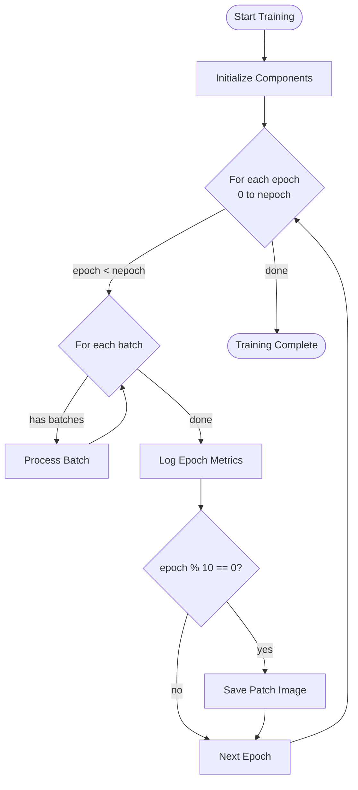
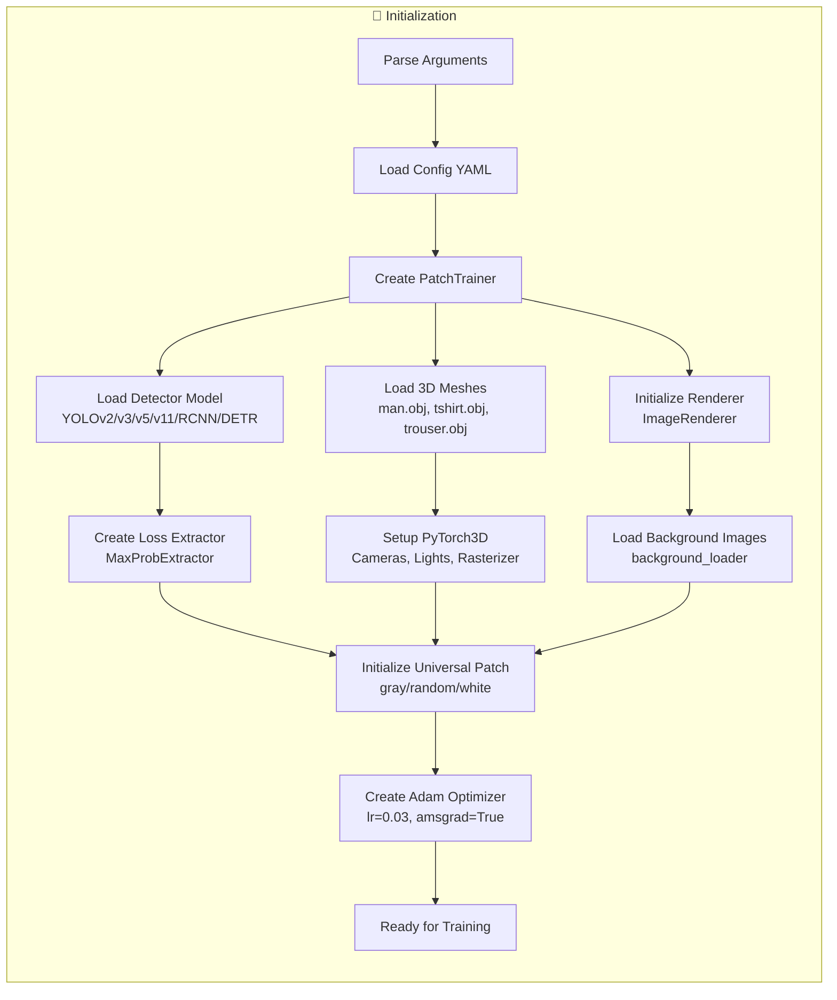
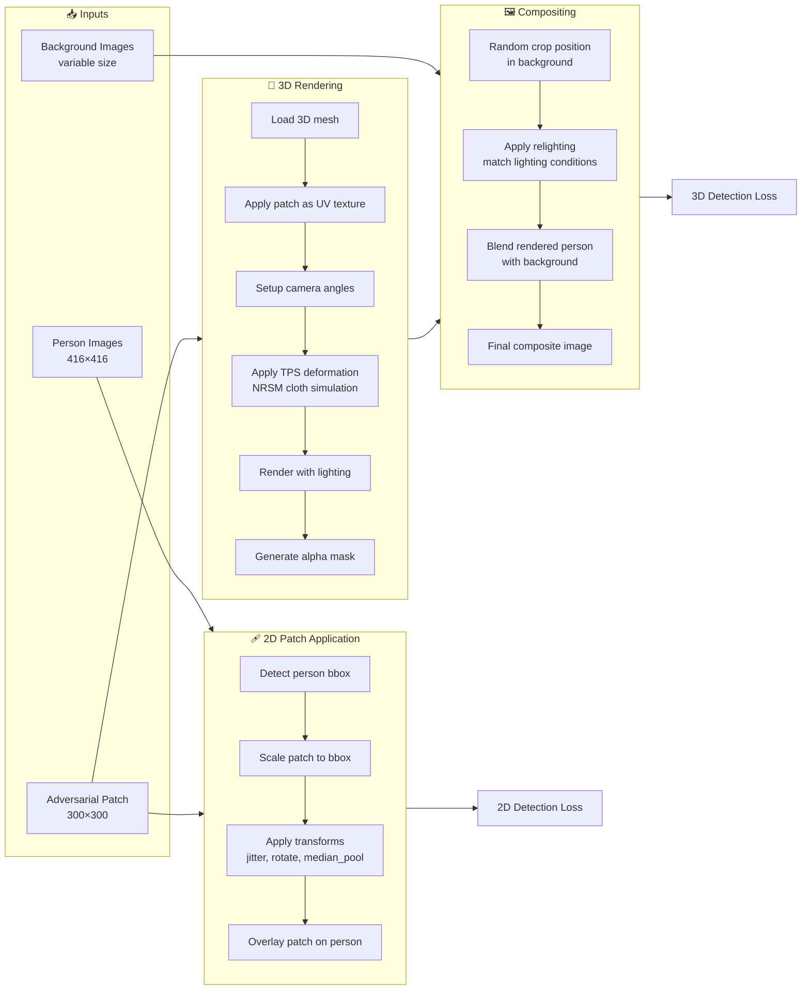
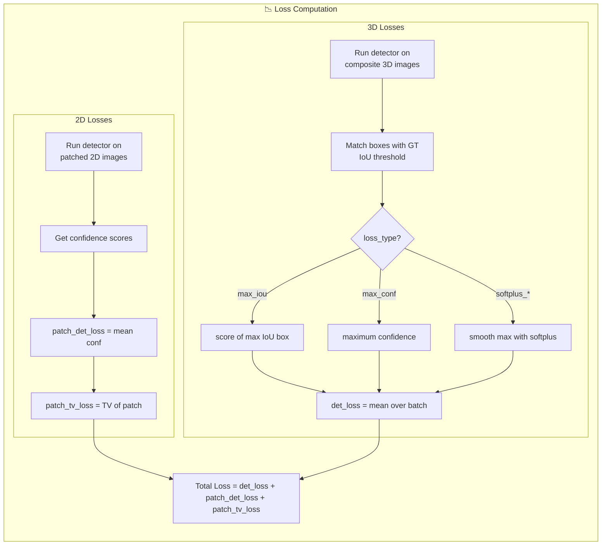
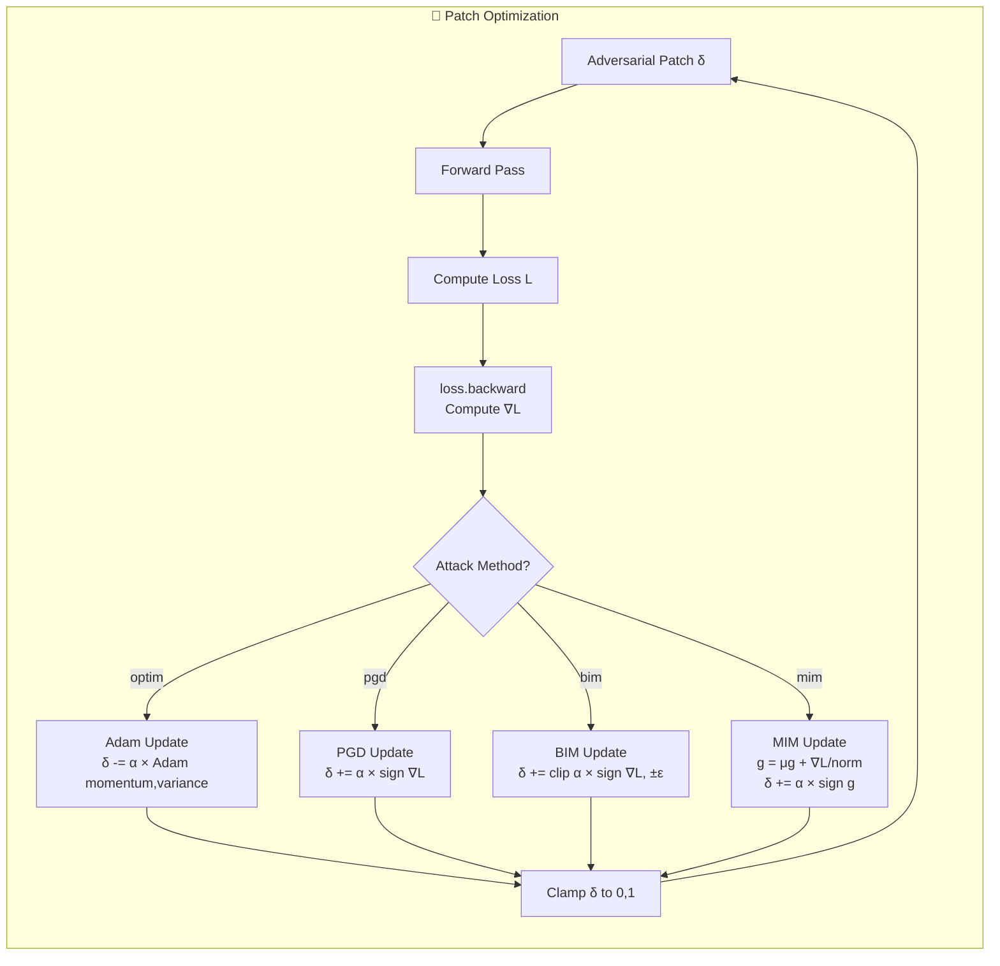
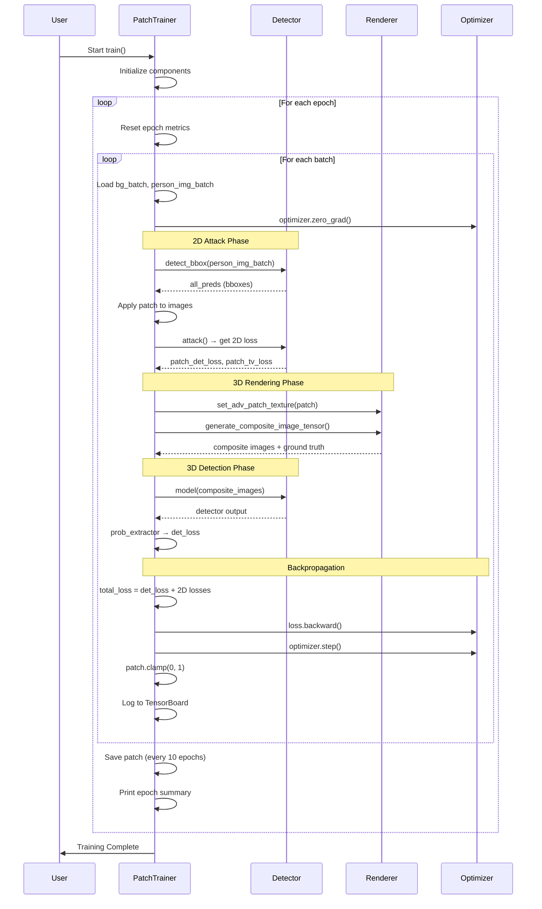

# Training Process Flowchart

Complete step-by-step visualization of the AdvReal adversarial patch training process.

---

## 🔄 High-Level Training Loop



---

## 📦 Initialization Phase



---

## 🔁 Single Batch Processing (Core Loop)

```mermaid
flowchart TB
    subgraph BATCH ["📦 Process Single Batch"]
        direction TB
        
        B1[/"Load bg_batch from<br/>background_loader"/] --> B2[/"Load person_img_batch from<br/>person_detection_loader"/]
        
        B2 --> ZERO[optimizer.zero_grad]
        
        ZERO --> D2D
        
        subgraph D2D ["🎯 2D Detection Attack"]
            direction TB
            D1[Detect persons in<br/>person_img_batch] --> D2[Get bounding boxes<br/>all_preds]
            D2 --> D3{Any targets<br/>detected?}
            D3 -->|no| SKIP[Skip batch]
            D3 -->|yes| D4[Apply patch to<br/>person images]
            D4 --> D5[Compute 2D losses<br/>patch_det_loss, patch_tv_loss]
        end
        
        D5 --> R3D
        
        subgraph R3D ["🎨 3D Rendering Pipeline"]
            direction TB
            R1[Clone & clamp patch<br/>patch_c = patch.clamp 0,1] --> R2[Set patch as texture<br/>renderer.set_adv_patch_texture]
            R2 --> R3[For each background image]
            R3 --> R4[Render 3D person<br/>with patch texture]
            R4 --> R5[Composite onto background<br/>generate_composite_image_tensor]
            R5 --> R6[Stack all composites<br/>p_img_batch]
        end
        
        R6 --> DET3D
        
        subgraph DET3D ["🔍 3D Detection"]
            direction TB
            T1[Normalize images<br/>to 0-1 range] --> T2[Run detector<br/>model forward pass]
            T2 --> T3[Extract confidence scores<br/>prob_extractor]
            T3 --> T4[Compute 3D detection loss<br/>det_loss]
        end
        
        T4 --> LOSS[Compute Total Loss<br/>L = det_loss + patch_det_loss + patch_tv_loss]
        
        LOSS --> BP
        
        subgraph BP ["⬅️ Backpropagation"]
            direction TB
            B1B[loss.backward] --> B2B[optimizer.step]
            B2B --> B3B[patch.clamp 0,1]
        end
        
        BP --> LOG_B[Log to TensorBoard<br/>every 10 batches]
    end
```



---

## 🖼️ Image Transformation Pipeline



---

## 📉 Loss Computation Flow



---

## 🔄 Optimization Loop Detail



---

## 📊 Complete Training Timeline



---

## 📁 Data Flow Summary

```
┌──────────────────────────────────────────────────────────────────────┐
│                         TRAINING LOOP                                │
├──────────────────────────────────────────────────────────────────────┤
│                                                                      │
│  ┌──────────────┐     ┌──────────────┐     ┌──────────────┐          │
│  │ Person       │     │ Background   │     │ Adversarial  │          │
│  │ Images       │     │ Images       │     │ Patch        │          │
│  │ (INRIAPerson)│     │ (NuScenes)   │     │ (Learnable)  │          │
│  └──────┬───────┘     └──────┬───────┘     └──────┬───────┘          │
│         │                    │                    │                  │
│         ▼                    │                    │                  │
│  ┌──────────────┐            │                    │                  │
│  │ 2D Detection │◄───────────┼────────────────────┤                  │
│  │ + Patch Apply│            │                    │                  │
│  └──────┬───────┘            │                    │                  │
│         │                    │                    │                  │
│         ▼                    │                    ▼                  │
│  ┌──────────────┐            │           ┌──────────────┐            │
│  │ 2D Det Loss  │            │           │ 3D Rendering │            │
│  │ + TV Loss    │            │           │ (PyTorch3D)  │            │
│  └──────┬───────┘            │           └──────┬───────┘            │
│         │                    │                  │                    │
│         │                    ▼                  ▼                    │
│         │           ┌────────────────────────────────┐               │
│         │           │ Composite Images               │               │
│         │           │ (3D rendered + background)     │               │
│         │           └──────────────┬─────────────────┘               │
│         │                          │                                 │
│         │                          ▼                                 │
│         │                   ┌──────────────┐                         │
│         │                   │ 3D Detection │                         │
│         │                   │ Loss         │                         │
│         │                   └──────┬───────┘                         │
│         │                          │                                 │
│         ▼                          ▼                                 │
│  ┌────────────────────────────────────────────────────────┐          │
│  │         TOTAL LOSS = L_3D + L_2D_det + L_2D_TV         │          │
│  └────────────────────────────────────────────────────────┘          │
│                              │                                       │
│                              ▼                                       │
│                    ┌──────────────────┐                              │
│                    │ Backpropagation  │                              │
│                    │ + Optimizer Step │                              │
│                    └────────┬─────────┘                              │
│                              │                                       │
│                              ▼                                       │
│                    ┌──────────────────┐                              │
│                    │ Updated Patch    │──────────────┐               │
│                    └──────────────────┘              │               │
│                                                      │               │
│                              ▲                       │               │
│                              └───────────────────────┘               │
│                           (Next Iteration)                           │
│                                                                      │
└──────────────────────────────────────────────────────────────────────┘
```

---

## ⚙️ Key Config Parameters

| Parameter | Location | Effect |
|-----------|----------|--------|
| `nepoch` | args | Number of training epochs |
| `batch_size` | args | Images per batch |
| `lr` | args | Adam learning rate |
| `tv_eta` | YAML | TV loss weight |
| `ATTACK_CLASS` | YAML | Target class ID |
| `loss_type` | args | Detection loss type |
| `train_iou` | args | IoU threshold for loss |
